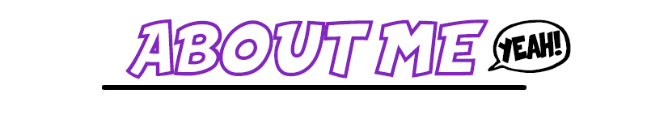

   
      
         

 - Atualmente estou estudando no Bootcamp da DIO para o estágio a Avenade. 
    			   - Também estou estudando Azure Cloud para a prova AZ-900. 
    			   - Fui um dos vencedores do Cloud Skill Challenger da DIO em parceria com a Microsoft. 
                   - Sempre fui apaixonado por tecnologia, me sinto realizado estudando Lingagens de programação. 
    			   - Acredito que essa área necessite de mais diversidade, todos merecem conhecer esse mundo incrível da tecnologia!   
                   - Minhas habilidades mais desenvolvidas são em:    
      
      
      
      
      
       
    
    

​    

